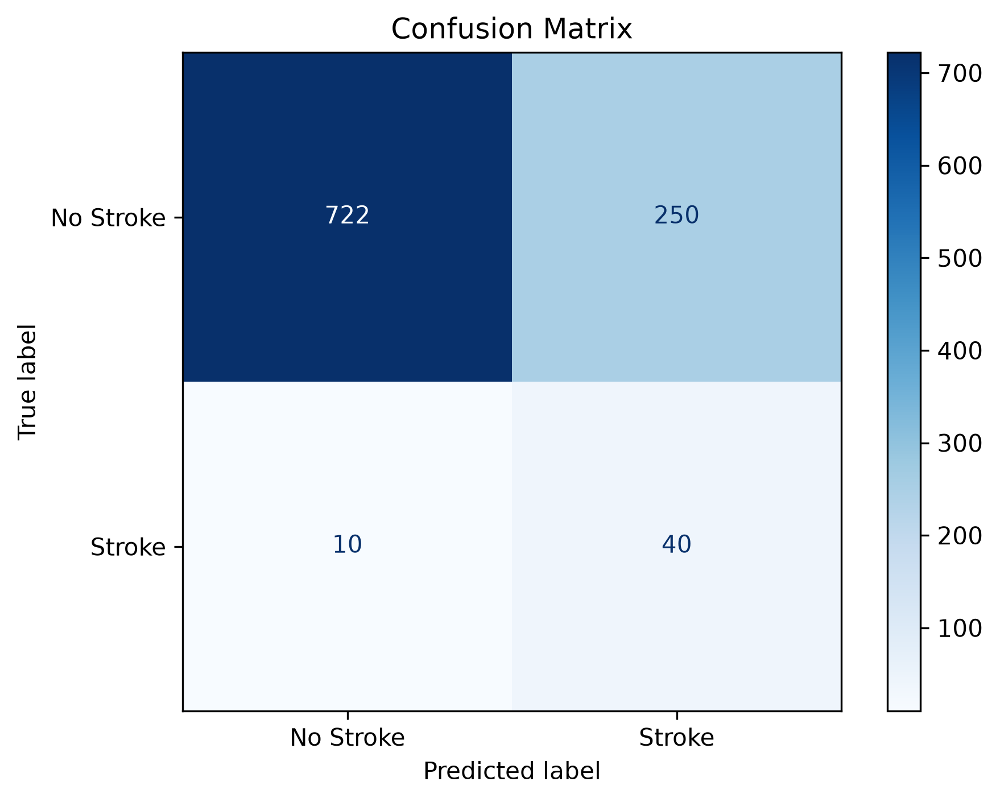
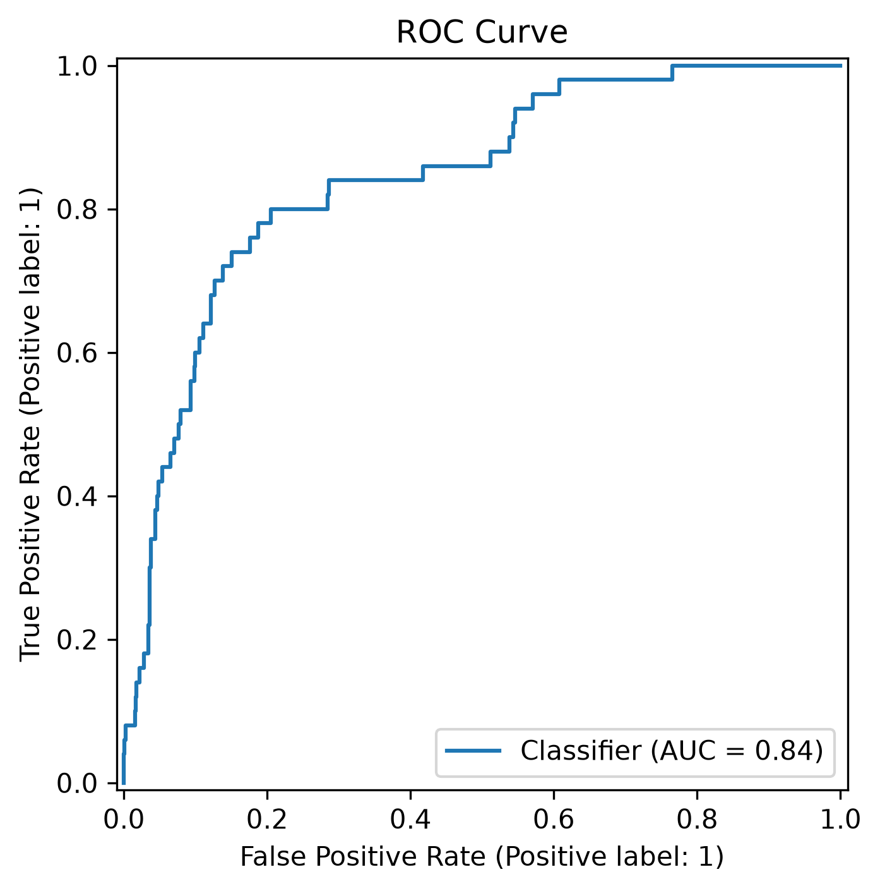
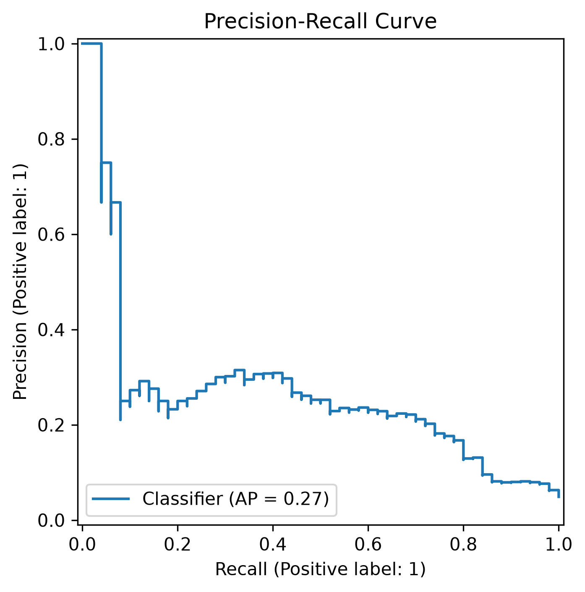
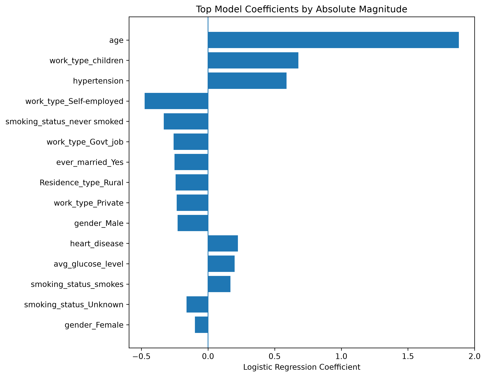

# Stroke Prediction with Imbalanced Machine Learning

A reproducible machine learning pipeline for stroke classification using clinical and demographic features.

The project focuses on a key challenge of the dataset: **severe class imbalance**. Rather than relying on raw accuracy, models are compared using stratified cross-validation and imbalance-aware metrics such as PR-AUC, ROC-AUC, balanced accuracy, recall, precision, and F1 score.

## Results

The final model is a **class-weighted Logistic Regression**, selected using mean PR-AUC across 5-fold stratified cross-validation.

### Final Holdout Performance

| Metric | Score |
|---|---:|
| ROC-AUC | 0.8437 |
| PR-AUC | 0.2682 |
| Balanced Accuracy | 0.7714 |
| Stroke Recall | 0.8000 |
| Stroke Precision | 0.1379 |
| Stroke F1 | 0.2353 |

On the untouched holdout set, the model identified **40 of 50 stroke-positive samples**.

The relatively low precision reflects the trade-off introduced by class weighting on a dataset where stroke cases represent only about **4.9%** of samples. For this reason, conventional accuracy is not used as the primary model-selection metric.

## Model Comparison

Four candidate models were evaluated using stratified 5-fold cross-validation:

| Model | ROC-AUC | PR-AUC | Balanced Accuracy | Stroke Recall | Stroke F1 |
|---|---:|---:|---:|---:|---:|
| Random Forest | 0.8160 | 0.1718 | 0.5047 | 0.0100 | 0.0191 |
| Class-Weighted Random Forest | 0.8171 | 0.1732 | 0.5282 | 0.0753 | 0.1068 |
| Logistic Regression | 0.8396 | 0.1922 | 0.4999 | 0.0000 | 0.0000 |
| **Class-Weighted Logistic Regression** | **0.8387** | **0.1933** | **0.7626** | **0.7890** | **0.2274** |

Values shown are mean cross-validation scores.

The experiment demonstrates why accuracy and the default classification threshold can be misleading for highly imbalanced classification problems. Standard models achieved strong majority-class performance while detecting very few stroke-positive samples.

## Evaluation

### Confusion Matrix



### ROC Curve



### Precision-Recall Curve



## Model Interpretation

Logistic Regression coefficients are extracted from the fitted preprocessing and classification pipeline.



Coefficient magnitude represents influence within the fitted model. These values should not be interpreted as causal medical risk factors.

## Dataset

The project uses the **Healthcare Dataset Stroke Data**, containing 5,110 observations.

Target distribution:

- No stroke: 4,861 samples (95.13%)
- Stroke: 249 samples (4.87%)

The original dataset contains missing BMI values, which are handled inside the preprocessing pipeline.

### Features

The model uses:

- Age
- Average glucose level
- BMI
- Hypertension
- Heart disease
- Gender
- Marital status
- Work type
- Residence type
- Smoking status

The `id` field is excluded from model training.

## Machine Learning Pipeline

Preprocessing is implemented with `scikit-learn` pipelines to prevent inconsistent transformations between training and inference.

Numerical features are:

- Median imputed
- Standardized

Categorical features are:

- Imputed using the most frequent category
- One-hot encoded

The dataset is separated into:

- 80% development set
- 20% untouched holdout set

Model selection is performed only on the development set using **stratified 5-fold cross-validation**. The selected model is then trained on the full development set and evaluated once on the holdout set.

## Project Structure

```text
.
├── assets/
│   ├── confusion_matrix.png
│   ├── feature_coefficients.png
│   ├── metrics.txt
│   ├── precision_recall_curve.png
│   └── roc_curve.png
├── data/
│   └── healthcare-dataset-stroke-data.csv
├── models/
│   └── stroke_model.joblib
├── src/
│   ├── data.py
│   ├── evaluate.py
│   ├── inference.py
│   └── train.py
├── .gitignore
├── README.md
└── requirements.txt
```

## Installation

Clone the repository and install the dependencies:

```bash
git clone https://github.com/ardaatikk/stroke_prediction.git
cd stroke_prediction
pip install -r requirements.txt
```

## Training

Run model comparison, cross-validation, final model selection, and holdout evaluation:

```bash
python src/train.py
```

The trained pipeline is saved to:

```text
models/stroke_model.joblib
```

## Evaluation

Generate the evaluation metrics and visualizations:

```bash
python src/evaluate.py
```

## Inference

Predictions can be generated directly from raw feature values:

```bash
python src/inference.py \
  --age 67 \
  --avg_glucose_level 228.69 \
  --bmi 36.6 \
  --hypertension 0 \
  --heart_disease 1 \
  --gender Male \
  --ever_married Yes \
  --work_type Private \
  --Residence_type Urban \
  --smoking_status "formerly smoked"
```

The serialized model contains both preprocessing and classification steps, so raw input values can be passed directly to the pipeline.

## Tech Stack

- Python
- NumPy
- pandas
- scikit-learn
- Matplotlib
- joblib

## Limitations

This project is intended as a machine learning and data science demonstration.

The dataset is small and highly imbalanced, and the model has not undergone external or clinical validation. The reported results are specific to the dataset and experimental setup used in this repository.

**The model is not intended for medical diagnosis or clinical decision-making.**
